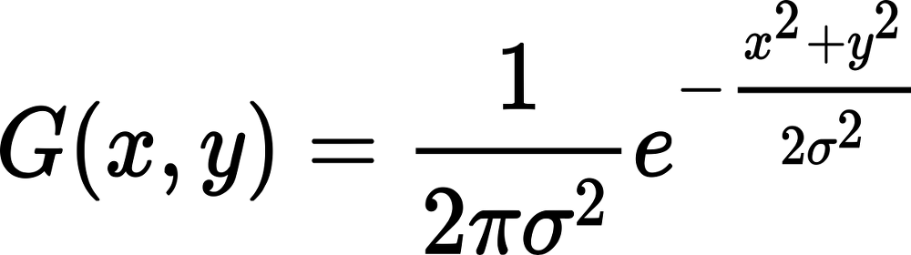

<p align="left">

</p>

***
# Gaussian Blur in C 

This is a simple C program that uses the Gaussian function seen at the start of the readme to manipulate images, compared to a box filter the Gaussian blur does blurring more accurate reducing even bokeh some of the times. etc. etc. We could just say its low-pass filter okay?


# Usage
After you compile "gaussian_blur.c" with this command (IMPORTANT you use this parameters":

```
gcc gaussian_blur.c -lm -o gaussian_blur
```

The command is pretty simple:

```
./gaussian_blur <input_image> <output_image> <kernel_size> <sigma>
```
